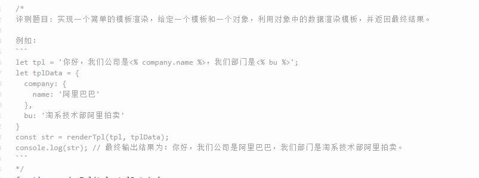

一天我偶然在群里看到一个水友的问题，自己就试着解决了一下，这是一个`解析模板`的问题。

实现关键思路：

* 匹配对应的模板语法，下例为`<% %>`
* 深度解析使用的变量。



版本一：最多只能处理二层数据。

```
{
        let str =
          "我们公司是<% data.name.as %>, 我所在的部门是: <%department%>";
        let tplData = {
          data: {
            name: "阿里巴巴",
          },
          department: "淘系开发部",
        };
        function parseTPL(str, params) {
          let MatchReg = /<%\s*([\w\.]+)\s*%>/gi;
          let reg = /<%\s*([\w\.]+)\s*%>/;
          let matchs = str
            .match(MatchReg)
            .map((v) => v.replace(/[<%%>]/gi, "").trim());

          for (let val of matchs) {
            let arr = val.split(".");
            if (arr.length > 1) {
              str = str.replace(reg, params[arr[0]][arr[1]]);
            } else {
              str = str.replace(reg, params[arr[0]]);
            }
          }
          return str;
        }
        console.log(parseTPL(str, tplData));
}
```

版本二：递归处理深层次数据

```
 {
        let str =
          "我们公司是<% data.name.as %>, 我所在的部门是: <%department%>";
        let tplData = {
          data: {
            name: { as: "阿里巴巴" },
          },
          department: "淘系开发部",
        };
        
        function parseTPL(str, params) {
          let MatchReg = /<%\s*([\w\.]+)\s*%>/gi;
          let reg = /<%\s*([\w\.]+)\s*%>/;
          let matchs = str
            .match(MatchReg)
            .map((v) => v.replace(/[<%%>]/gi, "").trim());
          let results = [];
          
          //深层次解析对象结构，回调返回最深层的数据
          function deep(data, propsArr) {
            return propsArr.length > 1
              ? deep(data[propsArr[0]], propsArr.slice(1))
              : data[propsArr[0]];
          }

          for (let val of matchs) {
            let arr = val.split(".");
            str = str.replace(reg, deep(params, arr));
          }
          return str;
        }
        console.log(parseTPL(str, tplData));
      }
```

